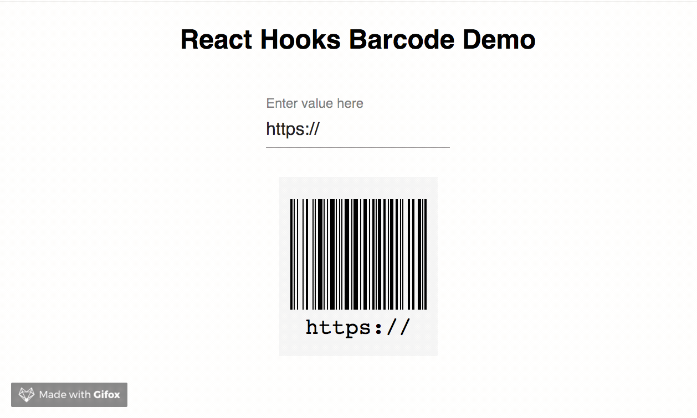

# react-hooks-barcode

[](https://github.com/ellerbrock/open-source-badges/)

[![NPM version][npm-image]][npm-url]
[![npm download][download-image]][download-url]
![last commit][last-commit-image]
![Repo size][repo-size-image]
![Github Top Language][language-image]

Super easy barcode generation for ReactJS.

This package uses [JsBarcode](https://github.com/lindell/JsBarcode)



## Install

> **Note:** Make sure that you have installed the correct version of `react(>= v16.8.0)` and `react-dom(>= v16.8.0)`.

### npm

```bash
npm install --save react-hooks-barcode
```

### yarn

```bash
yarn add react-hooks-barcode
```

## Demo

[Example](https://codesandbox.io/s/k50p47kk47) &emsp;&emsp; [Live Demo](https://k50p47kk47.codesandbox.io/)

## Usage

### import Barcode

```js
import Barcode from "react-hooks-barcode";
```

### Get barcode with `value`

```js
<Barcode value="https://reactjs.org/" />
```

## Configuring Options

```js
const config = {
  background: "#f5f5f5",
  marginTop: "20px",
  marginBottom: "20px",
  fontOptions: "italic",
  width: 2
};

<Barcode value="https://reactjs.org/" {...config} />;
```

## Available Options

### Refer to JsBarcode options [wiki page](https://github.com/lindell/JsBarcode/wiki/Options) for more information

```js
{
  width: 2,
  height: 100,
  format: "CODE128",
  displayValue: true,
  fontOptions: "",
  font: "monospace",
  textAlign: "center",
  textPosition: "bottom",
  textMargin: 2,
  fontSize: 20,
  background: "#ffffff",
  lineColor: "#000000",
  margin: 10,
  marginTop: undefined,
  marginBottom: undefined,
  marginLeft: undefined,
  marginRight: undefined
}
```

## Contribution

### Make a PR

[](https://github.com/phaniteja1/react-hooks-barcode)

## Development

> Node >= v8 LTS

- Clone the project to local disk
- `npm install`
- `npm start`

## License

[](https://opensource.org/licenses/mit-license.php)

[npm-image]: https://img.shields.io/npm/v/react-hooks-barcode.svg?style=flat-square
[npm-url]: https://npmjs.com/package/react-hooks-barcode
[download-image]: https://img.shields.io/npm/dm/react-hooks-barcode.svg?style=flat-square
[download-url]: https://npmjs.com/package/react-hooks-barcode
[language-image]: https://img.shields.io/github/languages/top/phaniteja1/react-hooks-barcode.svg?style=flat
[repo-size-image]: https://img.shields.io/github/repo-size/phaniteja1/react-hooks-barcode.svg?style=flat
[last-commit-image]: https://img.shields.io/github/last-commit/phaniteja1/react-hooks-barcode.svg?style=flat
